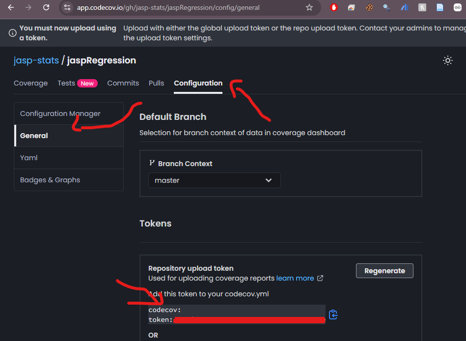

Every JASP module must have unit tests. Tests catch regressions, verify tables and plots produce expected output, and run automatically in CI on every push.

## Framework

JASP uses `testthat` through the `jaspTools` package, which wraps `testthat` with JASP-specific helpers for running analyses, comparing tables, and validating plots.

### Setup

```r
# Install jaspTools (one-time)
remotes::install_github("jasp-stats/jaspTools")
library(jaspTools)
```

For interactive debugging of analyses with `jaspTools` (including `browser()`), see @sec-jasptools-workflow.

## Test File Structure

```
tests/
├── testthat.R                    # Runner script
└── testthat/
    ├── test-analysisname.R       # One file per analysis
    ├── _snaps/                   # Auto-generated plot snapshots
    │   └── test-analysisname/
    │       └── plot-name.svg
    └── jaspfiles/                # Test data (recommended)
        ├── library/              # Datasets from the JASP data library
        ├── verified/             # Verified .jasp example files
        └── other/                # Additional test data
```

Test files follow the pattern: `test-{source}-{filename}.R`, where `{source}` indicates the data origin (e.g., `test-verified-ttest.R`, `test-library-BinomialTest.R`).

## Recommended: Generate Tests from Example Files {#sec-example-tests}

The preferred way to create tests is to **auto-generate them from `.jasp` example files**. This approach:

- Ensures your examples are always tested
- Produces consistent, comprehensive test coverage with minimal effort
- Keeps tests in sync with the actual user-facing examples

### Step 1: Add .jasp Files

Place your example `.jasp` files in the appropriate subfolder:

| Folder | Contents |
|--------|----------|
| `tests/testthat/jaspfiles/verified/` | Files from the JASP verification project |
| `tests/testthat/jaspfiles/library/` | Files from the JASP data library |
| `tests/testthat/jaspfiles/other/` | Other example files for testing |

### Step 2: Generate Tests

```r
library(jaspTools)
jaspTools::makeTestsFromExamples("jaspTTests")
```

This reads each `.jasp` example, extracts the options, runs the analysis, and generates test code. Generated test files are named `test-{source}-{filename}.R`.

### Step 3: Review

Always eyeball the generated tests. There are edge cases where `makeTestsFromExamples()` fails due to complex variable encoding (e.g., some SEM syntax, ordinal constraints). Add `skip()` for those cases:

```r
test_that("Complex SEM model runs", {
  skip("Complex variable encoding not yet supported by makeTestsFromExamples")
  # ...
})
```

### Step 4: Keep in Sync

When you update an example `.jasp` file, regenerate the corresponding test. The `verified/` folder is protected from accidental overwrites by default.

::: {.callout-important}
### Migrate Existing Tests
If your module still has the old `examples/` folder layout, move your `.jasp` files into `tests/testthat/jaspfiles/`, delete the old auto-generated test files, and re-run `makeTestsFromExamples()`. Make sure you have the latest `jaspTools` installed.
:::

## Writing Tests Manually

For cases not covered by example files — edge cases, specific error conditions, or fine-grained option combinations — write tests manually.

### Basic Structure

```r
test_that("Independent Samples T-Test produces correct table", {
  options <- analysisOptions("TTestIndependentSamples")
  options$dependent  <- "contNormal"
  options$groupingVariable <- "facGender"
  options$effectSize <- TRUE

  results <- runAnalysis("TTestIndependentSamples", "test.csv", options)

  table <- results[["results"]][["ttest"]][["data"]]
  jaspTools::expect_equal_tables(table, list(
    -0.153, 0.878, "contNormal", -0.214, 99, 0.831
  ))
})
```

### Setting Up Options

Use `analysisOptions()` to get an options list pre-populated with defaults:

```r
options <- analysisOptions("TTestIndependentSamples")
# Then override only what you need:
options$dependent <- "contNormal"
options$meanDifference <- TRUE
```

### Table Tests

`expect_equal_tables()` compares the analysis output table to a reference list of values:

```r
jaspTools::expect_equal_tables(table, list(
  "value1", "value2", "value3"  # expected cell values in row order
))
```

To generate the expected values list automatically:

```r
# Run the analysis, then:
jaspTools::makeTestTable(table)
# Prints a list(...) you can paste into your test
```

You can also bootstrap a manual test file by setting `makeTests = TRUE`:

```r
results <- runAnalysis("TTestIndependentSamples", "test.csv", options,
                       makeTests = TRUE)
# Prints boilerplate test code to the console — copy, refine, and save
```

### Plot Tests

Plot tests use SVG snapshot comparison:

```r
test_that("T-Test plot matches", {
  options <- analysisOptions("TTestIndependentSamples")
  options$dependent <- "contNormal"
  options$groupingVariable <- "facGender"
  options$descriptivesPlots <- TRUE

  results <- runAnalysis("TTestIndependentSamples", "test.csv", options)

  plotName <- results[["results"]][["descriptives"]][["collection"]][["descriptives_descriptivesPlot"]][["data"]]
  testPlot <- results[["state"]][["figures"]][[plotName]][["obj"]]
  jaspTools::expect_equal_plots(testPlot, "descriptives-plot")
})
```

On first run, the reference SVG is created in `_snaps/`. Subsequent runs compare against it.

### Managing Plot Snapshots

When a plot intentionally changes, update the reference:

```r
jaspTools::manageTestPlots()
```

This opens a Shiny app showing old vs. new plots. Accepting a change updates the SVG snapshot.

### Structural Plot Fallback {#sec-plot-fallback}

SVG snapshots are compared as exact text. This means that tiny, visually imperceptible differences in rendered coordinates — caused by different operating systems, graphics libraries, or floating-point behaviour — can cause plot tests to fail on CI (the automated tests that run on GitHub when you push a commit) even though the plots look identical. For example, an SVG path coordinate like `250.678901` on macOS might render as `250.678903` on the Ubuntu machines used by GitHub Actions. The plots are visually indistinguishable, but vdiffr flags them as different.

To handle this, `jaspTools` includes a **structural fallback**. When a vdiffr SVG comparison fails, it automatically falls back to comparing the underlying ggplot structure: the plotted data values, labels, scales, and layer specifications. If these match within a numeric tolerance, the test passes with a warning instead of failing.

#### Generating Reference Structures

The fallback compares against `.rds` snapshot files stored in `_snaps/<context>/reference_plotobject/`. These are generated automatically the first time a plot test runs, or can be regenerated with:

```r
options(jaspTools.plotStructure.update = TRUE)
jaspTools::testAll()
# Turn it off again afterwards:
options(jaspTools.plotStructure.update = FALSE)
```

The resulting `.rds` files should be committed alongside the SVG snapshots.

#### Adjusting Tolerance

For analyses with inherent numeric variation (e.g., MCMC-based Bayesian analyses), you can relax the comparison tolerance per test:

```r
jaspTools::expect_equal_plots(testPlot, "sequential-analysis", tolerance = 1e-3)
```

The default tolerance is `1e-3`. Lower values are stricter; higher values allow more numeric variation.

#### What the Fallback Looks Like

When the fallback accepts a plot, the test output shows a **warning** (not a failure):

```
Warning: vdiffr mismatch for 'my-plot-subplot-1' accepted by structural fallback.
```

This is expected when tests run on GitHub and cross-platform rendering differences are the only cause.

#### Inspecting SVG Differences

When a vdiffr comparison fails on GitHub, `jaspTools` saves the SVG that was generated during the test run as a `.new.svg` file. These are uploaded as downloadable artifacts on the GitHub Actions run page (requires the artifact upload step in `jasp-actions`). To inspect them:

1. Go to the failed GitHub Actions run
2. Scroll to the bottom and download the `snapshot-diffs` artifact
3. Place the `.new.svg` files in the corresponding `_snaps/<context>/` folder alongside the reference `.svg` files
4. Run `testthat::snapshot_review("<context>/")` to compare them side-by-side in a Shiny app

::: {.callout-tip}
It is difficult to trigger the structural fallback locally, since your machine produces consistent SVGs. The fallback is primarily relevant when tests run on GitHub, where the different OS and library versions cause rendering differences.
:::

### Testing Errors and Validation

```r
test_that("T-Test gives validation error with zero-variance variable", {
  options <- analysisOptions("TTestIndependentSamples")
  options$dependent <- "debMiss30"
  options$groupingVariable <- "facGender"

  results <- runAnalysis("TTestIndependentSamples", "test.csv", options)

  expect_identical(results[["status"]], "validationError")
})
```

## Running Tests

```r
# All tests in the module
jaspTools::testAll()

# A single analysis
jaspTools::testAnalysis("TTestIndependentSamples")
```

### Debugging Failures

| Symptom | Cause | Fix |
|---------|-------|-----|
| **Failure** (values differ) | Output changed intentionally | Update reference with `makeTestTable()` / `manageTestPlots()` |
| **Failure** (values differ) | Unintentional regression | Fix the R code |
| **Error** (test crashes) | R code throws an exception | Run the analysis interactively in RStudio to debug |
| **Plot failure** | SVG differs | Run `manageTestPlots()` to review; accept if change is intentional |

## GitHub Actions CI {#sec-ci}

Every JASP module should have a CI workflow that runs tests on push and PR:

```yaml
# .github/workflows/unittests.yml
name: Unit Tests

on: [push, pull_request]

jobs:
  test:
    runs-on: ${{ matrix.os }}
    strategy:
      matrix:
        os: [windows-latest, macOS-latest]

    steps:
      - uses: actions/checkout@v4
      - uses: jasp-stats/jasp-actions/setup-test-env@master
      - uses: jasp-stats/jasp-actions/run-unit-tests@master
```

If your module requires JAGS:

```yaml
      - uses: jasp-stats/jasp-actions/setup-test-env@master
        with:
          requiresJAGS: true
```

## Test Coverage {#sec-coverage}

### Coverage Goals

| Module type | Minimum coverage |
|------------|-----------------|
| Official JASP module | ≥ 70% of analyses have tests |
| Community module | At least one test per analysis that runs without error |

For the full module checklists, see @sec-publishing.

### Adding a Coverage Action

Every official JASP module should include a coverage workflow to track which parts of the code are covered by unit tests. This helps maintainers identify vulnerable areas and improve coverage in a targeted manner. Setting this up takes about 5 minutes per module.

::: {.callout-note}
Make sure you have the unit test workflow (`.github/workflows/unittests.yml`, described in @sec-ci) in place before adding the coverage action.
:::

#### Step 1: Add the workflow file

Create `.github/workflows/test-coverage.yml` with the following content:

```yaml
# .github/workflows/test-coverage.yml
on:
  push:
    branches:
      - master  # Essential for Codecov baseline
    paths: ['**.R', 'tests/**', '**.c', '**.cpp', '**.h', '**.hpp',
            'DESCRIPTION', 'NAMESPACE', 'MAKEVARS', 'MAKEVARS.win', '**.yml']

  pull_request:
    types: [opened, synchronize, reopened, ready_for_review]
    paths: ['**.R', 'tests/**', '**.c', '**.cpp', '**.h', '**.hpp',
            'DESCRIPTION', 'NAMESPACE', 'MAKEVARS', 'MAKEVARS.win']

jobs:
  coverage:
    # Run on push (merge) OR if the PR is NOT a draft
    if: github.event_name == 'push' || github.event.pull_request.draft == false

    uses: jasp-stats/jasp-actions/.github/workflows/coverage.yml@master
    with:
      needs_JAGS: false
    secrets:
      CODECOV_TOKEN: ${{ secrets.CODECOV_TOKEN }}
```

If your module relies on JAGS, set `needs_JAGS: true` (see e.g., `jaspRegression`).

#### Step 2: Add the Codecov token

1. Go to [app.codecov.io/gh/jasp-stats](https://app.codecov.io/gh/jasp-stats) and log in via GitHub.
2. Find your repository and go to the **Configuration** tab.
3. Under **General**, locate the **Repository upload token** (see @fig-codecov-token).
4. In your GitHub repository, go to **Settings → Secrets and variables → Actions** (see @fig-github-repo-secret).
5. Add a new repository secret named `CODECOV_TOKEN` with the token value.

{#fig-codecov-token}

{#fig-github-repo-secret}

Once coverage is set up, add the coverage badge to your module's README — see @sec-module-readme for details.
